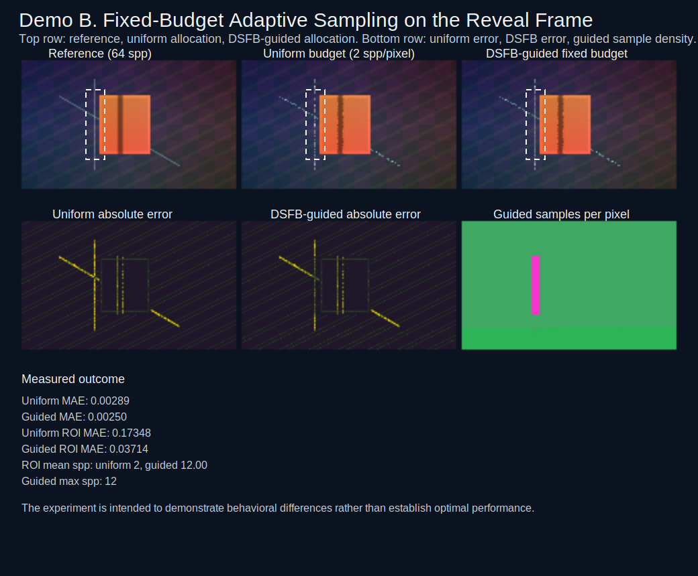

# DSFB Computer Graphics Demo B Report

## Overview

Demo B is a bounded fixed-budget adaptive-sampling study on the canonical reveal frame. It uses the DSFB trust field from Demo A as a supervisory signal for sample redistribution rather than as a temporal blend controller.

“The experiment is intended to demonstrate behavioral differences rather than establish optimal performance.”

## Sampling Surface

The estimator operates on a continuous version of the reveal frame with subpixel thin geometry, sharp foreground-object edges, and the same disocclusion event used by Demo A.

- Resolution: 160 x 96
- Reveal frame: 6
- Reference estimate: 64 spp per pixel

## Budget Fairness

The uniform baseline and the DSFB-guided allocation use the same total sample budget: 30720 samples.

The guided policy assigns a minimum of 1 spp per pixel, caps at 12 spp per pixel, and redistributes the remaining budget according to low-trust hazard weights.

## Metrics

- Uniform MAE: 0.00289
- Guided MAE: 0.00250
- Uniform RMSE: 0.01869
- Guided RMSE: 0.01504
- Uniform ROI MAE: 0.17348
- Guided ROI MAE: 0.03714
- Uniform ROI RMSE: 0.19957
- Guided ROI RMSE: 0.04356
- ROI mean spp: uniform 2.00, guided 12.00
- Guided max spp: 12

In this bounded synthetic setting, DSFB-guided allocation reduces reveal-region sampling error at fixed budget by steering more samples toward the low-trust thin-geometry disocclusion.

## Figures

Composite view of the reference, uniform estimator, guided estimator, error maps, and guided sample density. “The experiment is intended to demonstrate behavioral differences rather than establish optimal performance.”

## Limitations

- This is a static reveal-frame study rather than a temporal adaptive-sampling controller.
- The sampling surface is analytic and deterministic, not a production path tracer.
- The result demonstrates budget reallocation behavior rather than optimal sampling policy design.

## Future Work

- Extend the allocation policy over time so trust persistence influences future-frame budgets.
- Compare DSFB guidance against gradient-only or variance-only sampling heuristics.
- Move from this analytic surface to a stochastic renderer while preserving determinism for artifact generation.
