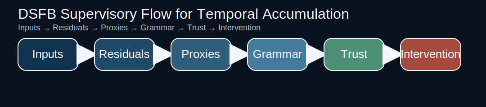
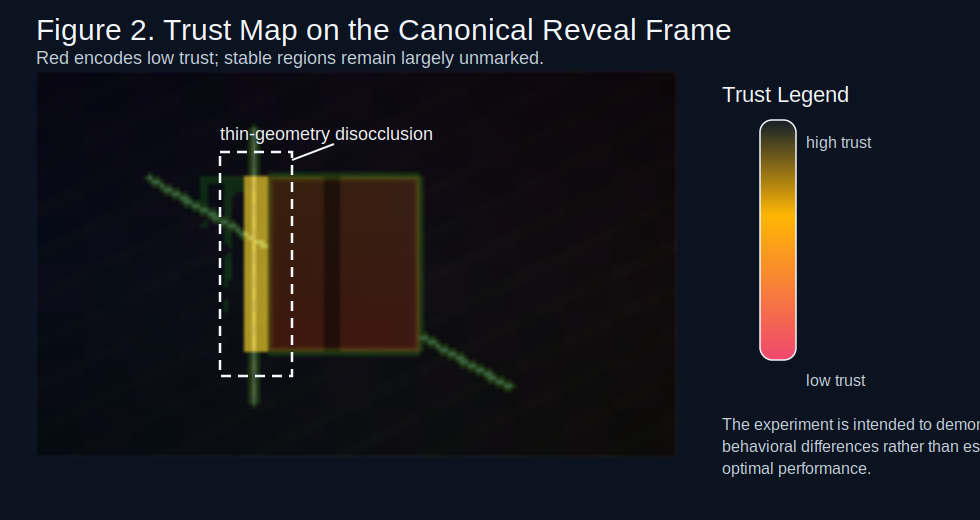
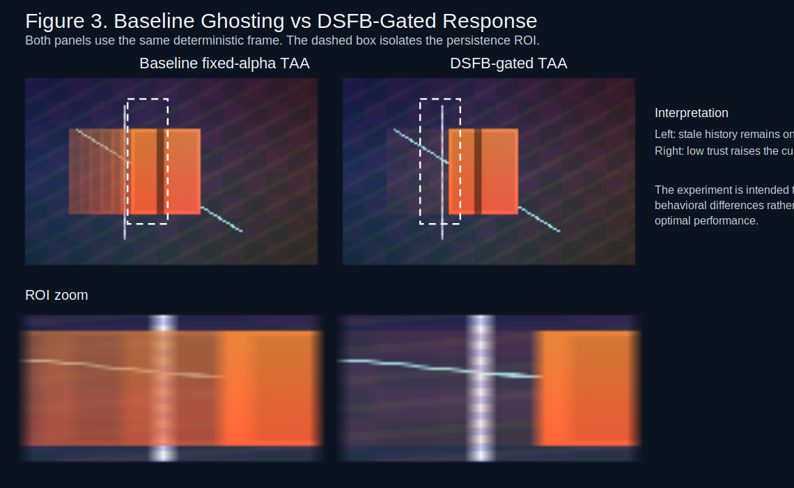
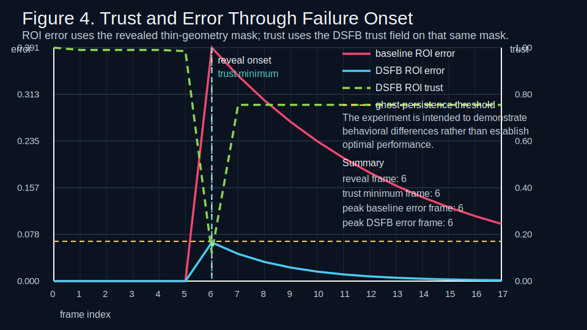

# DSFB Computer Graphics Report

## Overview

This crate implements a minimal synthetic experiment for temporal accumulation supervision. The scene is deterministic, bounded, and designed to make thin-geometry disocclusion visually interpretable.

“The experiment is intended to demonstrate behavioral differences rather than establish optimal performance.”

## Canonical Scene

The canonical sequence uses a moving opaque foreground rectangle, a static structured background, a one-pixel vertical element, and a one-pixel diagonal element. The object motion creates disocclusion when it stops after exposing the thin structure.

- Resolution: 160 x 96
- Frame count: 18
- Reveal frame: 6

## Baseline

The baseline is fixed-alpha temporal accumulation with alpha = 0.12. It uses the same reprojection field as the DSFB-gated path and intentionally omits production heuristics so the control-path difference remains explicit.

## DSFB-Gated Version

The DSFB path reuses the same temporal pipeline and only replaces the blending control path. Trust is computed from local residual evidence, visibility change, motion-edge structure, and thin-geometry support. Blend weights follow alpha_t(u) = alpha_min + (alpha_max - alpha_min) * (1 - trust_t(u)).

- alpha_min = 0.08, alpha_max = 0.96

## Metrics

- Average baseline MAE: 0.01228
- Average DSFB MAE: 0.00232
- Baseline ghost persistence: 12 frames
- DSFB ghost persistence: 0 frames
- Cumulative baseline ROI error: 2.55778
- Cumulative DSFB ROI error: 0.33962
- Trust/error correlation at reveal: 0.9644

In this bounded synthetic setting, the DSFB-gated path demonstrates reduced ghost persistence on the revealed thin structure relative to the baseline.

## Figures

Figure 1. System diagram of the supervisory flow. “The experiment is intended to demonstrate behavioral differences rather than establish optimal performance.”

Figure 2. Trust map overlay on the reveal frame, showing low trust near the disoccluded thin structure and motion edges. “The experiment is intended to demonstrate behavioral differences rather than establish optimal performance.”

Figure 3. Baseline fixed-alpha TAA versus DSFB-gated TAA on the same frame and ROI. “The experiment is intended to demonstrate behavioral differences rather than establish optimal performance.”

Figure 4. Persistence ROI error and trust over time, illustrating the trust response at failure onset. “The experiment is intended to demonstrate behavioral differences rather than establish optimal performance.”

## GPU Implementation Considerations

A future GPU realization can evaluate the supervisory layer per pixel or per tile because the current formulation uses only local residuals, local proxies, and bounded temporal history. The same structure is compatible with async-compute placement inside a broader graphics frame graph.

Concrete buffers include a residual buffer, proxy buffer, trust buffer, and history buffer. Optional debug or reduced-resolution support can use ROI masks and tile summary buffers.

Optimization strategies considered by the crate documentation include half resolution trust, tile aggregation, and temporal reuse of proxy.

“The DSFB supervisory layer can be implemented with local operations and limited temporal memory, with expected cost scaling linearly with pixel count and amenable to reduced-resolution evaluation.”

“The framework is compatible with tiled and asynchronous GPU execution.”

## Limitations

- This is a minimal synthetic demonstration, not a production renderer.
- The baseline is intentionally simple and does not include broader anti-ghosting heuristics.
- The artifact does not measure GPU timings or make optimality claims.
- Adaptive sampling is future work unless a separate crate-local demo artifact is generated.

## Future Work

- Add a fixed-budget adaptive-sampling study using the same trust field.
- Compare against stronger baselines such as variance gating or neighborhood clamping.
- Extend the synthetic scene to richer depth complexity while retaining determinism.
