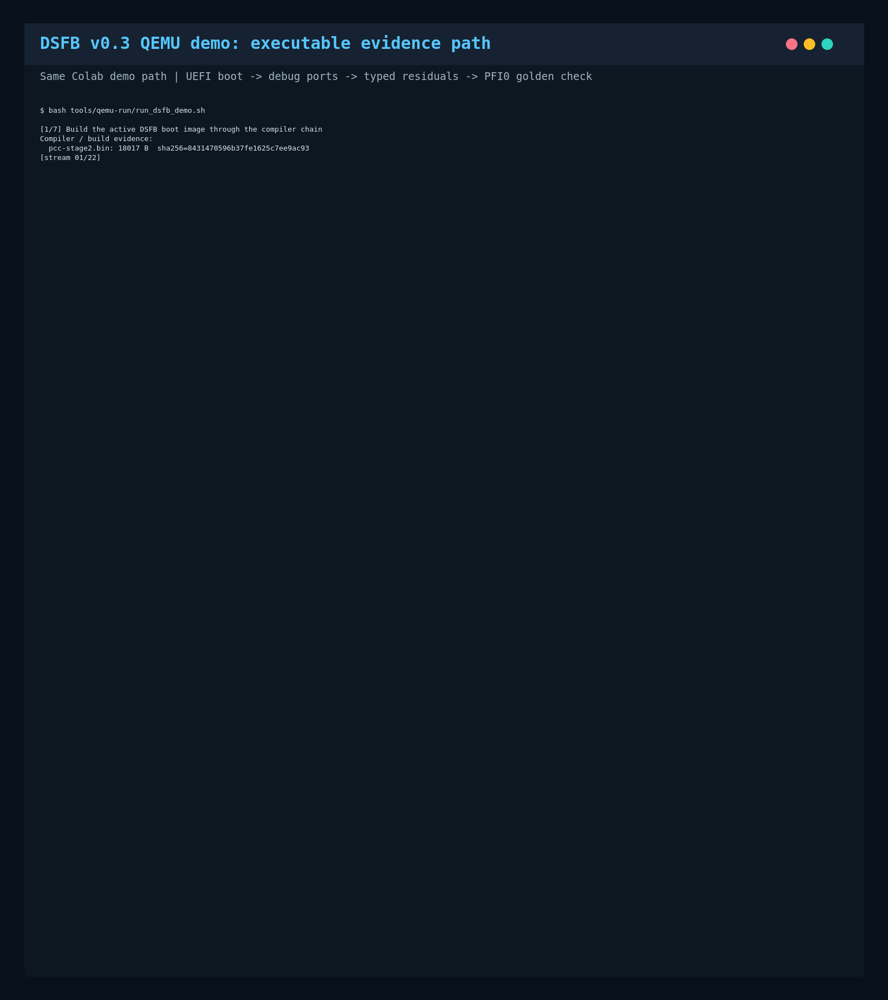
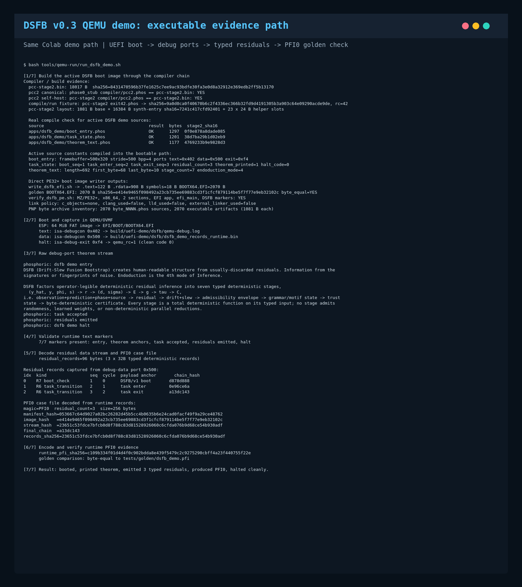

# DSFB-Phosphoric

[](https://colab.research.google.com/github/infinityabundance/dsfb/blob/main/crates/dsfb-phosphoric/notebooks/dsfb_phosphoric_colab.ipynb)
[](audit/dsfb-gray-2026-05-03T23-48-09Z/DSFB_PHOSPHORIC_GRAY_AUDIT_REPORT.md)


**Try it now (no install required) Click the Open in Colab badge above**
- 1. Open the Colab notebook
- 2. Click Runtime > Run all
- 3. Watch the 7-phase evidence path execute in ~2 minutes

**Phosphoric** is a from-scratch systems stack for single-task edge devices. No Rust, no LLVM, no external linker, no libc, no POSIX surface — everything below the application is in-tree. The stack is four pieces. **Phosphoric** is the language: a closed v0 grammar with affine capabilities, fixed-capacity collections, a six-element runtime effect alphabet, and per-function effect declarations. `no_std`, `no_alloc`, `no_unsafe`, no FFI. **pcc** is the self-hosted compiler: parses Phosphoric source and emits PE/COFF EFI directly, no assembler, no linker, no third-party codegen. The bootstrap reduces to a small ASM stub whose hash is pinned and whose source-to-ASM correspondence is byte-equal verified. **Ember** is the trusted nucleus — ~330 LOC on x86_64, per-arch ceilings 100–800 — owning CPU primitives, MMIO, and port I/O behind line-audited `trusted!` blocks. **PhosphorOS** is the kernel above Ember: fixed-capacity tables (64 tasks, 128 channels, 256 capability slots), generation-tagged handles, cooperative scheduling, one manifest-sealed task per device.



The closed grammar and per-image manifest force the authority graph — capabilities, IPC channels, MMIO ranges, effects, budgets — to be enumerated at build time, hashed into a `.pmanifest` certificate bundle, and cross-checked at boot and at every runtime authority transition. The kernel emits seven typed residual record kinds at those transitions; a chain-hash mixer folds each event into a deterministic stream that an off-device court re-derives independently.

v0.3 demonstrates the chain end-to-end: a 2,070-byte UEFI bootable runs under QEMU/OVMF, executes its task, emits three typed residuals to a debug-data port, produces a 256-byte PFI0 case file, and replays to verdict `NO_DRIFT` with chain hashes `d8 78 d8 88` → `0e 96 ce 6a` → `a1 3d c1 43`. Six CI gates pin the chain; any drift fails verification. Physical silicon (RP2350 candidate) is out of scope at v0.3.

*To our knowledge, Phosphoric is the first public working prototype of a forensic-primacy deterministic computing substrate spanning language, compiler, kernel, and operating-system layers: forensic evidence is not reconstructed from logs after execution, but emitted as typed residual records by the running substrate, chained into a PFI0 case file, and replayed through a closed deterministic verdict table.*


Phosphoric v0.3 explores a new forensic-primacy computing category: computation as typed residual evidence, bound into replayable case files and adjudicated by deterministic verdict logic. Adjacent fields include verified compilers, verified kernels, provenance systems, forensic specification languages, and deterministic replay; Phosphoric’s contribution is the integration of those concerns into a bootable, razor-scoped evidence-first substrate.


Phosphoric is a deliberately constrained stack for building tiny, auditable, capability-oriented systems for ultra-low-cost edge hardware.

> **The substrate's job is to make residual truth legible.**

The project is split into three layers:

- **Ember** — the minimal trusted machine nucleus. Owns boot, traps, page tables, context switch, and the small set of hardware-dangerous operations. Every privileged operation is justified at line precision.
- **Phosphoric** — the language surface above Ember. `no_std`, `no_alloc`, `no_unsafe`, with affine capabilities, fixed-capacity collections, and explicit declared effects on every function.
- **PhosphorOS** — the operating system layer built on Ember and Phosphoric. Fixed-capacity tables, message-passing IPC, capability-based authority, single-window GUI demo today.



## Goal

A small, defensible computing stack with hard constraints:

- `no_std`, `no_alloc`, `no_unsafe` in language programs
- Capability-oriented authority, no ambient access
- Deterministic memory behaviour and bounded loops by language rule
- Software-first enforcement on $5-class microcontrollers, with hardware protection (TrustZone-M, MPU, PMP, OTP, signed boot) as belt-and-suspenders
- Honest verification culture: every claim is traceable to a verifier or a labelled non-goal

The project occupies a narrow, defensible niche: language-enforced affine capabilities + deterministic memory + ultra-narrow trusted surface, deployed by a small team on a multi-year horizon. It is not trying to be a general-purpose systems language.

## Architectural Stance

- Ember owns the unavoidable machine-dangerous operations.
- Phosphoric owns the constrained safe surface above Ember.
- PhosphorOS owns the GUI, IPC, scheduling, and application model built on those layers.
- Capability handles are explicit and affine by default.
- Runtime memory use is fixed-capacity and deterministic.
- Failures are explicit results, not hidden traps or panic-driven control flow.

## v0 Constraints

- Single prototype target: `x86_64` on `UEFI`, booted in `QEMU`. Used as the reproducible smoke-test loop.
- Real deployment targets: $5-class MCUs — RP2040, RP2350, ESP32-C3, low-end Cortex-M, simple RISC-V with PMP.
- Software rendering first, using a linear framebuffer.
- Fixed-capacity tables, queues, buffers, and GUI objects.
- Message passing preferred over shared mutable state.
- No heap-backed runtime path.
- No hidden dynamic dispatch.
- No ambient authority.
- No unrestricted pointer arithmetic in normal language code.

## Current Development Rule

The repository is framing-first. The project starts with specification documents that define the threat model, trusted computing base, non-goals, language semantics, and safety boundary before implementation expands.

The current golden booted vertical slice consumes active `.phos` sources under `apps/demo/`, emits reviewed IR/ASM evidence artifacts, verifies them byte-for-byte against golden fixtures, and writes `BOOTX64.EFI` with a narrow project-owned PE/COFF image writer. The direct EFI image owns the UEFI entrypoint, routes one synthetic input event, renders a bounded command list, and exits deterministically under QEMU. Active verification records no external assembler/linker use and no non-Phosphoric runtime objects.

The QEMU run emits the marker line `phosphoric: entering generated boot-asm demo`, followed by per-stage progress markers and the closing `phosphoric: demo complete`.

## DSFB v0.3 Court Path: What, Why, and How

This package's active reproducibility path is the v0.3 DSFB demo plus the
`verify-court-active` forensic gate. It is designed to make the executable
artifact, runtime residual evidence, case-file bytes, and verdict fixtures
inspectable from a clean clone.

### What It Demonstrates

- A Phosphoric-source DSFB demo is emitted as a UEFI `BOOTX64.EFI` image.
- The image boots under QEMU/OVMF and prints the DSFB theorem text.
- The runtime emits three typed residual records.
- The emitted residual stream is wrapped into a PFI0 case file.
- The runtime PFI is byte-compared against `tests/golden/dsfb_demo.pfi`.
- The PFI fixtures are replayed into deterministic verdict text.
- Malformed PFI fixtures are rejected with named, stable reasons.
- Court producer gates check narrow Phosphoric-source byte producers for the
  R5 record, PFI0 case file, and verdict bytes.

### Mathematical Model

DSFB frames forensic computation as a deterministic residual pipeline:

```text
(y_hat, y, phi, s) -> r -> (d, sigma) -> E -> g -> tau -> C
```

Read this as:

- `y_hat`: predicted or declared state
- `y`: observed state
- `phi`: phase or execution context
- `s`: source or authority context
- `r`: typed residual
- `(d, sigma)`: drift and slew classification
- `E`: admissibility envelope
- `g`: grammar or motif state
- `tau`: trust state
- `C`: byte-deterministic certificate or verdict

The v0.3 QEMU demo does not claim to solve that whole research program. It
pins a narrow executable path where residual evidence is emitted, packaged,
hashed, replayed, and checked by deterministic gates.

### Residual Record Math

Each runtime residual record is a fixed 32-byte structure:

```text
kind:u8 | arch_id:u8 | seq:u16 | cycle:u64 | payload:[u8;14] | chain_hash:[u8;4] | pad:[u8;2]
```

The `chain_hash` is a byte-stable 4-byte mixer used for fixture continuity, not
a cryptographic hash. For a 28-byte event vector and four previous chain bytes,
the verifier re-derives:

```text
primes = [31, 131, 524287, 16777213]
s[n] = prev[n] + sum(event[k] * primes[n] for k in 0..27)
chain_hash[n] = s[n] mod 256
```

SHA-256 is used separately for artifact and stream hashes. The R5 MMIO boundary
fixture locks the canonical vector `declared=0x1000..0x10FF`,
`observed=0x1100` to `chain_hash=8aa2ca5e`.

### PFI0 Case File Layout

PFI0 is the replayable evidence container checked by
`tools/verify/check_pfi_layout.sh`:

```text
magic "PFI0"
residual_count:u32le
reserved header bytes
manifest_hash:sha256
image_hash:sha256
stream_hash:sha256(records)
Residual records, 32 bytes each
final_chain_hash
reserved footer bytes
```

The layout gate checks magic, size, count, reserved zero regions, stream hash,
closed residual kind taxonomy, monotonic sequence numbers, chain continuity, and
footer final-chain anchoring.

### Code Path Map

- `apps/dsfb_demo/` - active v0.3 DSFB demo source files
- `compiler/pcc2.phos` - Phosphoric compiler source used by the active path
- `tools/phosphoric/write_dsfb_efi.sh` - emits the DSFB UEFI image
- `tools/qemu-run/run_dsfb_demo.sh` - boots the image, captures residuals, and writes the runtime PFI
- `tests/golden/dsfb_demo.pfi` - golden runtime PFI fixture
- `tools/verify/fixtures/pfi/` - PFI case-file fixtures
- `tools/verify/fixtures/verdicts/` - expected deterministic verdict text
- `tools/court/` - narrow court reference and producer gates
- `notebooks/dsfb_phosphoric_colab.ipynb` - clean Colab reproduction path

### Main Command

```bash
make -k verify-court-active
```

This is the active forensic court gate. It intentionally prints `[scaffold]`
disclosures for historical or out-of-tree checks that are absent from a public
source-only clone. Those disclosures are recorded as limitations, not counted as
empirical pass evidence.

## Reproducible Run Paths

### Google Colab

The primary external smoke/repro path is:

```text
notebooks/dsfb_phosphoric_colab.ipynb
```

The notebook starts from a fresh Colab runtime, clones
`https://github.com/infinityabundance/dsfb.git`, installs QEMU/OVMF host
dependencies, runs `make -k verify-court-active`, prints the DSFB QEMU log,
PFI hashes, verdict fixtures, release checksums, and release archive contents,
then exposes the evidence files for download.

The notebook's claim is intentionally narrow: it records that the checked
commands pass on that Colab runtime at the printed commit and QEMU/OVMF package
versions. It is not a claim of bit-identical output across arbitrary hosts.

### Local Ubuntu / Debian QEMU

From a clean host:

```bash
sudo apt-get update
sudo apt-get install -y --no-install-recommends \
  git make coreutils dosfstools mtools qemu-system-x86 ovmf

git clone https://github.com/infinityabundance/dsfb.git
cd dsfb/crates/dsfb-phosphoric

make -k verify
make -k verify-court-active
bash tools/qemu-run/run_dsfb_demo.sh
tools/release/package_release.sh
```

Important generated evidence paths:

```text
build/uefi-demo/dsfb/qemu-debug.log
build/uefi-demo/dsfb/linked-artifact.txt
build/uefi-demo/dsfb/dsfb_demo.pfi
build/release/SHA256SUMS
```

If QEMU reports a temporary file failure under read-only `/var/tmp`, see
[docs/QEMU_VVFAT_TMPDIR.md](docs/QEMU_VVFAT_TMPDIR.md). The active DSFB runner
uses a build-local FAT image and avoids QEMU `fat:rw:` vvfat mode.

## Audit Reports

The current DSFB Gray static audit artifacts are in
[audit/dsfb-gray-2026-05-03T23-48-09Z/](audit/dsfb-gray-2026-05-03T23-48-09Z/).

- [DSFB_PHOSPHORIC_GRAY_AUDIT_REPORT.md](audit/dsfb-gray-2026-05-03T23-48-09Z/DSFB_PHOSPHORIC_GRAY_AUDIT_REPORT.md) — human-readable audit summary
- [dsfb_phosphoric_scan.txt](audit/dsfb-gray-2026-05-03T23-48-09Z/dsfb_phosphoric_scan.txt) — raw `dsfb-gray` text report
- [dsfb_phosphoric_scan.sarif.json](audit/dsfb-gray-2026-05-03T23-48-09Z/dsfb_phosphoric_scan.sarif.json), [dsfb_phosphoric_scan.intoto.json](audit/dsfb-gray-2026-05-03T23-48-09Z/dsfb_phosphoric_scan.intoto.json), and [dsfb_phosphoric_scan.dsse.json](audit/dsfb-gray-2026-05-03T23-48-09Z/dsfb_phosphoric_scan.dsse.json) — machine-readable audit outputs

The badge score is an advisory source-visible review-readiness score from
`dsfb-gray`, not a certification result, runtime correctness proof, or universal
reproducibility claim. This scan reported `0` Rust source files scanned and
`26399` artifact files inspected, so function-level Rust checks should be read
as scanner coverage limits for this artifact-heavy package.

## Documentation

Public documentation lives under [docs/](docs/):

- [docs/PHOSPHORIC.md](docs/PHOSPHORIC.md) — the language: surface, semantics, type system, effects, capabilities, profiles
- [docs/EMBER.md](docs/EMBER.md) — the trusted nucleus: minimality contract, trust audit discipline, per-arch primitives
- [docs/PHOSPHOROS.md](docs/PHOSPHOROS.md) — the OS layer: capability tables, IPC, windows, framebuffer, demo loop
- [docs/COMPILER.md](docs/COMPILER.md) — the compiler: lexer, parser, type checker, codegen, host/trusted/boot/runtime profile lowering
- [docs/QEMU_VVFAT_TMPDIR.md](docs/QEMU_VVFAT_TMPDIR.md) — QEMU `fat:rw:` `/var/tmp` failure and the build-local FAT-image fix
- [docs/language/](docs/language/) — formal specifications: v0 freeze, grammar, type system, effect lattice, memory model, profile manifests
- [docs/abi.md](docs/abi.md), [docs/BOOT_ABI_V1.md](docs/BOOT_ABI_V1.md), [docs/ir.md](docs/ir.md) — boot ABI and IR specifications
- [ember/docs/](ember/docs/) — the Ember nucleus's per-module trust audit and minimality contracts
- [kernel/docs/](kernel/docs/) — the runtime kernel's per-module specifications

## Repository Layout

```
apps/demo/             — bootable demo programs (Phosphoric source)
bootstrap/             — bootstrap chain manifest and runbook
compiler/              — Phosphoric self-hosted compiler (lexer, parser, typeck, codegen)
config/                — build configuration (target budgets, profile manifests)
docs/                  — public documentation
ember/                 — Ember trusted nucleus (per-arch trusted! primitives)
kernel/                — PhosphorOS runtime kernel (capability tables, IPC, windows)
notebooks/             — external reproducibility notebooks
tests/                 — conformance suite, golden fixtures
tools/                 — verification scripts, host-profile verifiers, image builders
LICENSE                — Apache License 2.0
NOTICE                 — copyright and attribution
README.md              — this file
Makefile               — verification targets
```

## Citation

If you use this crate or reference its companion paper, please cite:

> **de Beer, R.** (2026). 
> *DSFB-Phosphoric Structural Semiotics Engine for Deterministic Forensic Computing: A DSFB-Native Execution Substrate for Typed Residual Emission at Compile-Time-Checked Authority Boundaries in Single-Purpose Edge Devices* 
> (v1.0). Zenodo. [https://doi.org/10.5281/zenodo.20024283]


## License

Licensed under the Apache License, Version 2.0. See [LICENSE](LICENSE) and [NOTICE](NOTICE).

Copyright 2026 Invariant Forge LLC.

## Project Link and IP Notice

Repository:
[https://github.com/infinityabundance/dsfb/tree/main/crates/dsfb-phosphoric](https://github.com/infinityabundance/dsfb/tree/main/crates/dsfb-phosphoric)

Licensed under Apache 2.0 - Copyright 2026 - Invariant Forge LLC. Commercial
use requires a separate license. licensing@invariantforge.net
